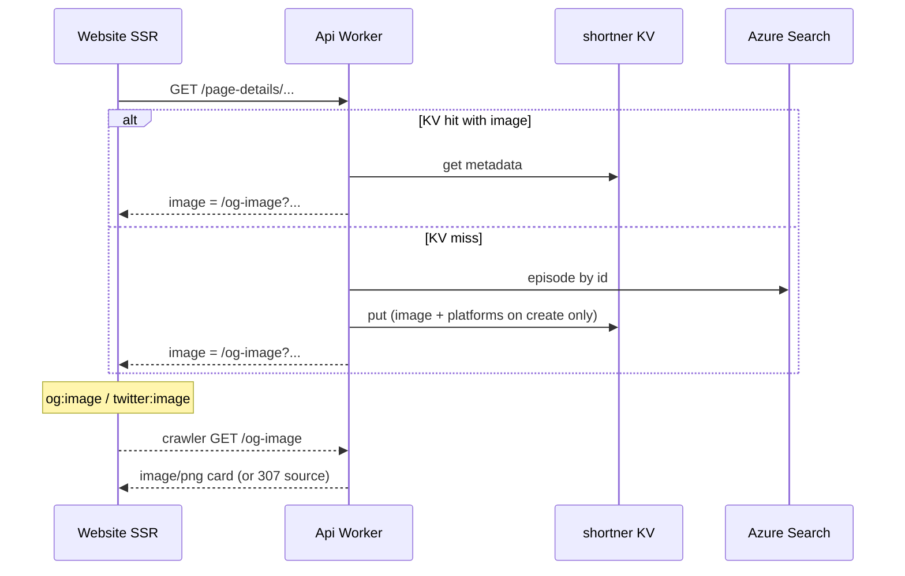

# OG share-image cards

Design for episode Open Graph / Twitter card images served by the Api Worker
`GET /og-image`. Replaces a generic mic watermark with a **composed Cult Podcasts
card** that embeds episode art and brand type.

## Goals

- Make shared short URLs (`s.cultpodcasts.com`) and episode pages read as Cult Podcasts,
  not anonymous art with a stock icon.
- Keep crawlers working when render fails (307 to the source art URL).
- Support two Twitter card modes already encoded as `imageAspect`:
  - **wide** → `summary_large_image` (YouTube / BBC iPlayer / Internet Archive)
  - **square** → `summary` (Spotify / Apple / BBC Sounds)

## Non-goals

- Full site rebrand (favicon, marketing site) — card system only.
- Rewriting existing shortener KV keys (still: create with image on miss; never patch existing).
- Official platform trademark lockups beyond simple icon marks (no “Listen on …” copy).

## Shared layout

Wide and square use the **same content and the same spatial layout**. Aspect only
changes canvas size and type scale.

| Content |
|---------|
| Episode art (no frame — soft corner radius only) |
| Podcast service icons (icon-only row) |
| Site logo + `CULT PODCASTS` (Instrument Serif, amber) |
| Episode name (title) |
| Podcast name |
| Duration · date |

```
[ episode art ]  CULT PODCASTS
                 episode name
                 podcast name
                 duration · date
                 service icons
```

| Zone | Content |
|------|---------|
| Left | Episode art sized to the **source aspect ratio**, fitted inside a max box — never cropped; no amber border |
| Right | brand → episode name → podcast name → duration · date → **icon-only** platform row (packed, vertically centred) |

| Aspect | Canvas | Art max box | Twitter card |
|--------|--------|-------------|--------------|
| `a=wide` | 1200×630 | 740×574 | `summary_large_image` |
| `a=square` | 800×418 | 360×378 | `summary` |

Displayed art width/height = source pixels scaled to fit the max box (`min` of both axes). Copy is packed top-to-bottom (icons under meta) and centred in the text column — no large void from `space-between`. Same composition for both aspects.

## Query contract

```
GET /og-image
  ?u=<https episode art>
  &a=wide|square          # default square
  &t=<episode title>
  &p=<podcast name>
  &d=<duration>
  &r=<release date>       # display string from page-details
  &pl=youtube,spotify,apple,bbc
```

- `u` must be `https` and an allowlisted host (`episodeShareImage.isAllowedShareImageSourceHost`).
- `p`, `d`, and `r` apply to **both** aspects (omitted from the card when empty).
- `pl` is optional; chips omitted when empty.
- Page-details builds this URL via `buildBrandedOgImageUrl` when share art exists.

## Rendering stack

| Layer | Choice | Why |
|-------|--------|-----|
| HTML → SVG layout | `workers-og` (`ImageResponse`) | Satori + Yoga/resvg Wasm **imported as modules** (Workers block runtime Wasm *compile*) |
| Type | **Instrument Serif** (brand) + **Figtree Semibold** (title / podcast / meta); site logo mark inline with brand | Matches website display/UI fonts |
| Colour | Ink `#0b0d12`, amber brand `#f5c056`, secondary/meta `#f0f2f5` / `#e8ebf0` | High contrast on dark card |
| Platform icons | Copied from website assets / `apple-podcasts-svg` (Apple purple person + arcs; Spotify Material green; YouTube play; BBC Sounds bars) | Must match site marks at chip size |
| Long titles | Soft wrap; smaller type when long **or** any token ≥14–16 chars; hard truncate to a **line budget** from text-column width (≈3–4 lines) on a word boundary so `…` stays on the last visible line | Char-only caps can overflow the line clamp and hide the ellipsis |
| Failure | 307 → source `u` (+ `X-Og-Error` on preview/debug) | Crawlers still get an image |

Do **not** use bare `@resvg/resvg-wasm` / Satori without module-bundled Yoga on Workers — that yields `Wasm code generation disallowed by embedder`.

## Data flow



## Local testing

See [README § OG cards](../README.md#og-share-image-cards) and `npm run og:preview`.

## Related PRs / surfaces

| Repo | Role |
|------|------|
| Api | `/og-image`, page-details URL builder, KV `platforms` on create |
| Website | SEO tags from page-details `image` / `imageAspect` |
| RPP | Shortener write with share-image metadata; short-URL-only social when `HasShareImage` |

## Open tweaks

- Icon SVGs are simplified marks, not official assets — replace if brand/legal requires.
